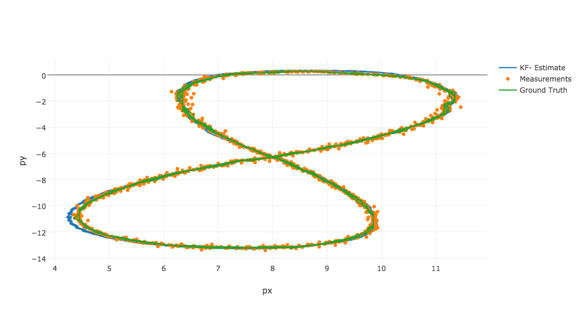
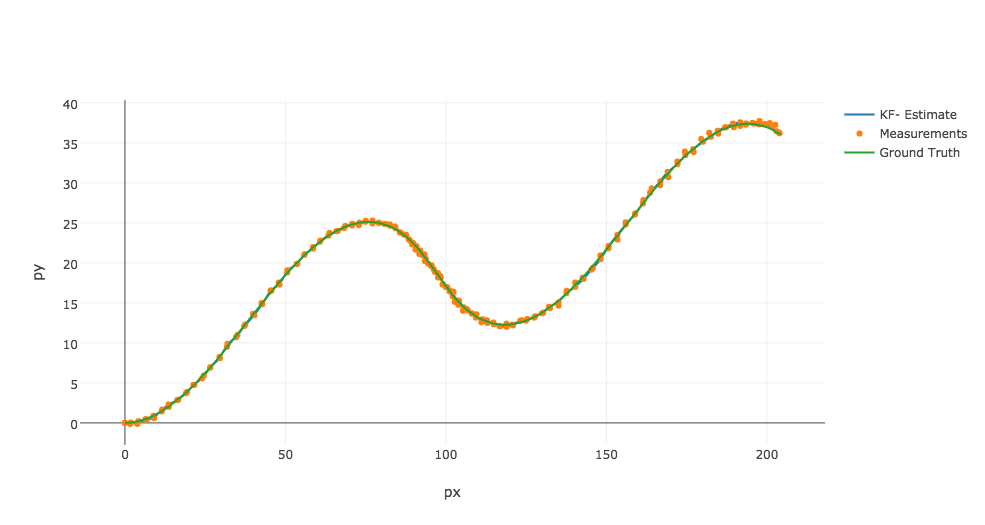

# Extended-Kalman-Filter (EKF)

Extended Kalman Filter in C++ for Lidar and Radar data Sensor Fusion. This implementation of EKF is written in C++, custom and targeted to vehicle localization. It takes data from Lidar and Radar to calculate vehicle position and vehicle velocity.

This implementation of EKF differs from standard implementation of EKF in a way that
- For measurement update of Lidar data a linear function is used
- For prediction step a linear model is used so instead of non-linear model and Jacobian Fj, regular Kalman Filter equations and matrix F are used. 


**sample-laser-radar-measurement-data-1**



**sample-laser-radar-measurement-data-2**



This code uses [Eigen library](https://d17h27t6h515a5.cloudfront.net/topher/2017/March/58b7604e_eigen/eigen.zip). I have also added this library to repo for convinience. You can also download it directly to get its latest version.

## Getting Started

```
// Create a Fusion EKF instance
FusionEKF fusionEKF;

// Create a measurement package to process
MeasurementPackage measurement_pack;

measurement_pack.sensor_type_ = MeasurementPackage::LASER;
measurement_pack.raw_measurements_ = VectorXd(2);

float px = 1;
float py = 2;
long timestamp = 45454354; //some timestamp in micro seconds

measurement_pack.raw_measurements_ << px, py;
measurement_pack.timestamp_ = timestamp;

fusionEKF.ProcessMeasurement(measurement_pack);
Eigen::VectorXd x = fusionEKF.GetEstimations();
std::cout << "Estimated x: " << x << std::endl;
```

## Accuracy of this Extend Kalman Filter Implementation

I tested this algorithm on two data files provided in _data_ folder. 

- Testing on file _sample-laser-radar-measurement-data-1.txt_ I got 

``
Accuracy - RMSE:
px = 0.0651648
py = 0.0605379
vx = 0.533212
vy = 0.544193
``

- Testing on file _sample-laser-radar-measurement-data-2.txt_ I got
``
Accuracy - RMSE:
px = 0.185496
py = 0.190302
vx = 0.476754
vy = 0.804469
``

## Basic Build Instructions

1. Clone this repo. You can use the build-script.sh to build and run with cmake and make automatically or you can follow steps given below.
2. Make a build directory: `mkdir build && cd build`
3. Compile: `cmake .. && make` 
   * On windows, you may need to run: `cmake .. -G "Unix Makefiles" && make`
4. Run it: `./ExtendedKF path/to/input.txt path/to/output.txt`. You can find
   some sample inputs in 'data/'.
    - eg. `./ExtendedKF ../data/sample-laser-radar-measurement-data-1.txt output.txt`

## Class Details

- **Kalman_filter** contains core code/calculations required for Extended Kalman Filter. It contains the class KalmanFilter 
- **FusionEKF** is a layer on top of KalmanFilter class to handle initialization, coordinates mapping and state/covariance matrix initializations.
- **Tools** contains utility functions to calculate RMSE to evaluate EKF accuracy and Jacobian matrix `Hj` used in Radar measurement update.


## Dependencies

* cmake >= 3.5
 * All OSes: [click here for installation instructions](https://cmake.org/install/)
* make >= 4.1
  * Linux: make is installed by default on most Linux distros
  * Mac: [install Xcode command line tools to get make](https://developer.apple.com/xcode/features/)
  * Windows: [Click here for installation instructions](http://gnuwin32.sourceforge.net/packages/make.htm)
* gcc/g++ >= 5.4
  * Linux: gcc / g++ is installed by default on most Linux distros
  * Mac: same deal as make - [install Xcode command line tools]((https://developer.apple.com/xcode/features/)
  * Windows: recommend using [MinGW](http://www.mingw.org/)
  
## Possible Issues and Improvements
- For the very first measurement, I just initialize the `timestamp` and state vector `x` and there is no prediction as right now my state Transition matrix F depends on timestamp difference (`delta_t`). 
- When calculating Jacobian, if there is a division by zero I ignore that measurement update completely. May be there is a better way to handle it.
